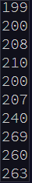
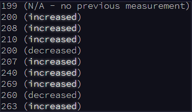
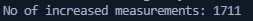
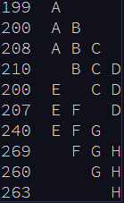
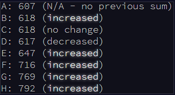
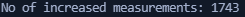

# [--- Day 1: Sonar Sweep ---](https://adventofcode.com/2021/day/1)  

You're minding your own business on a ship at sea when the overboard alarm goes off! You rush to see if you can help. Apparently, one of the Elves tripped and accidentally sent the sleigh keys flying into the ocean!

Before you know it, you're inside a submarine the Elves keep ready for situations like this. It's covered in Christmas lights (because of course it is), and it even has an experimental antenna that should be able to track the keys if you can boost its signal strength high enough; there's a little meter that indicates the antenna's signal strength by displaying 0-50 **stars**.

Your instincts tell you that in order to save Christmas, you'll need to get all **fifty stars** by December 25th.

Collect stars by solving puzzles. Two puzzles will be made available on each day in the Advent calendar; the second puzzle is unlocked when you complete the first. Each puzzle grants **one star**. Good luck!

As the submarine drops below the surface of the ocean, it automatically performs a sonar sweep of the nearby sea floor. On a small screen, the sonar sweep report (your puzzle input) appears: each line is a measurement of the sea floor depth as the sweep looks further and further away from the submarine.

For example, suppose you had the following report:

This report indicates that, scanning outward from the submarine, the sonar sweep found depths of `199`, `200`, `208`, `210`, and so on.

The first order of business is to figure out how quickly the depth increases, just so you know what you're dealing with - you never know if the keys will get carried into deeper water by an ocean current or a fish or something.

To do this, **count the number of times a depth measurement increases** from the previous measurement. (There is no measurement before the first measurement.) In the example above, the changes are as follows:

In this example, there are `7` measurements that are larger than the previous measurement.

**How many measurements are larger than the previous measurement?**

To begin, [get your puzzle input](./input).

Answer: **1711**

---  

# Solution (Silver Star)  

Run the python scrip _main1.py_ to get the solution given the input file _input.txt_:  
`python3 main1.py`  

---  

# --- Part Two ---  

Considering every single measurement isn't as useful as you expected: there's just too much noise in the data.

Instead, consider sums of a **`three-measurement sliding window`**. Again considering the above example: 

Start by comparing the first and second three-measurement windows. The measurements in the first window are marked `A` (`199`, `200`, `208`); their sum is `199 + 200 + 208 = 607`. The second window is marked `B` (`200`, `208`, `210`); its sum is `618`. The sum of measurements in the second window is larger than the sum of the first, so this first comparison **increased**. 

Your goal now is to **count the number of times the sum of measurements in this sliding window increases** from the previous sum. So, compare `A` with `B`, then compare `B` with `C`, then `C` with `D`, and so on. Stop when there aren't enough measurements left to create a new three-measurement sum.

In the above example, the sum of each three-measurement window is as follows:

In this example, there are **`5`** sums that are larger than the previous sum.

Consider sums of a three-measurement sliding window. **How many sums are larger than the previous sum?**

Answer: **1743**

Although it hasn't changed, you can still [get your puzzle input](./input).

---  

# Solution (Gold Star)  

Run the python scrip _main2.py_ to get the solution given the input file _input.txt_:  
`python3 main2.py`  

