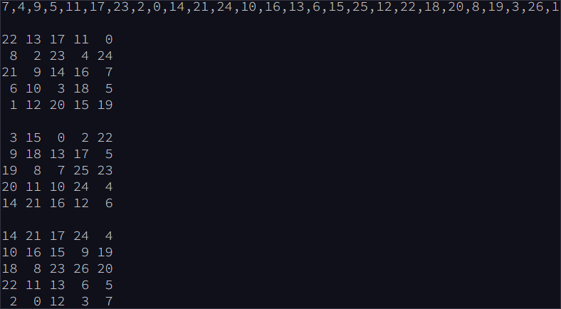
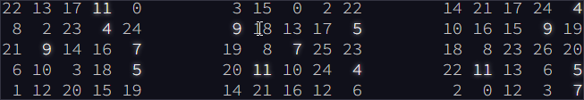
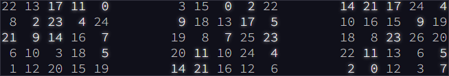
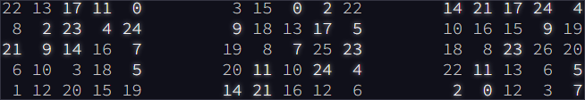
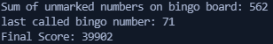
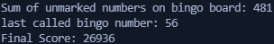

# [--- Day 4: Giant Squid ---](https://adventofcode.com/2021/day/4)

You're already almost 1.5km (almost a mile) below the surface of the ocean, already so deep that you can't see any sunlight. What you **can** see, however, is a giant squid that has attached itself to the outside of your submarine.

Maybe it wants to play [bingo](https://en.wikipedia.org/wiki/Bingo_(American_version))?

Bingo is played on a set of boards each consisting of a 5x5 grid of numbers. Numbers are chosen at random, and the chosen number is **marked** on all boards on which it appears. (Numbers may not appear on all boards.) If all numbers in any row or any column of a board are marked, that board **wins**. (Diagonals don't count.)

The submarine has a **bingo subsystem** to help passengers (currently, you and the giant squid) pass the time. It automatically generates a random order in which to draw numbers and a random set of boards (your puzzle input). For example:

After the first five numbers are drawn (`7`, `4`, `9`, `5`, and `11`), there are no winners, but the boards are marked as follows (shown here adjacent to each other to save space):

After the next six numbers are drawn (`17`, `23`, `2`, `0`, `14`, and `21`), there are still no winners:

Finally, `24` is drawn:

At this point, the third board **wins** because it has at least one complete row or column of marked numbers (in this case, the entire top row is marked: **`14 21 17 24 4`**).

The **score** of the winning board can now be calculated. Start by finding the **sum of all unmarked numbers** on that board; in this case, the sum is `188`. Then, multiply that sum by the number that was just called when the board won, `24`, to get the final score, `188 * 24 = `**`4512`**.

To guarantee victory against the giant squid, figure out which board will win first. **What will your final score be if you choose that board?**

To begin, [get your puzzle input](./input.txt).

Answer: **39902**

---  

# Solution (Silver Star)  

Run the python scrip _main1.py_ to get the solution given the input file _input.txt_:  
`python3 main1.py`  

---  

# --- Part Two ---  

On the other hand, it might be wise to try a different strategy: let the giant squid win.

You aren't sure how many bingo boards a giant squid could play at once, so rather than waste time counting its arms, the safe thing to do is to **figure out which board will win last** and choose that one. That way, no matter which boards it picks, it will win for sure.

In the above example, the second board is the last to win, which happens after `13` is eventually called and its middle column is completely marked. If you were to keep playing until this point, the second board would have a sum of unmarked numbers equal to 148 for a final score of `148 * 13 = `**`1924`**.

Figure out which board will win last. **Once it wins, what would its final score be?**

Answer: **26936**

Although it hasn't changed, you can still [get your puzzle input](./input).

---  

# Solution (Gold Star)  

Run the python scrip _main2.py_ to get the solution given the input file _input.txt_:  
`python3 main2.py`  

