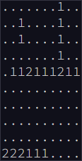

# [--- Day 5: Hydrothermal Venture ---](https://adventofcode.com/2021/day/5)  

You come across a field of [hydrothermal vents](https://en.wikipedia.org/wiki/Hydrothermal_vent) on the ocean floor! These vents constantly produce large, opaque clouds, so it would be best to avoid them if possible.

They tend to form in **lines**; the submarine helpfully produces a list of nearby lines of vents (your puzzle input) for you to review. For example:

Each line of vents is given as a line segment in the format `x1,y1 -> x2,y2` where `x1,y1` are the coordinates of one end the line segment and `x2,y2` are the coordinates of the other end. These line segments include the points at both ends. In other words:

- An entry like `1,1 -> 1,3` covers points `1,1`, `1,2`, and `1,3`.  
- An entry like `9,7 -> 7,7` covers points `9,7`, `8,7`, and `7,7`.

For now, **only consider horizontal and vertical lines**: lines where either `x1 = x2` or `y1 = y2`.

So, the horizontal and vertical lines from the above list would produce the following diagram:

In this diagram, the top left corner is `0,0` and the bottom right corner is `9,9`. Each position is shown as **the number of lines which cover that point** or `.` if no line covers that point. The top-left pair of `1`s, for example, comes from `2,2 -> 2,1`; the very bottom row is formed by the overlapping lines `0,9 -> 5,9` and `0,9 -> 2,9`.

To avoid the most dangerous areas, you need to determine **the number of points where at least two lines overlap**. In the above example, this is anywhere in the diagram with a `2` or larger - a total of **`5`** points.

Consider only horizontal and vertical lines. **At how many points do at least two lines overlap?**

To begin, [get your puzzle input](./input.txt).

Answer: **6397**

---  

# Solution (Silver Star)  

Run the python scrip _main1.py_ to get the solution given the input file _input.txt_:  
`python3 main1.py`  

---  

