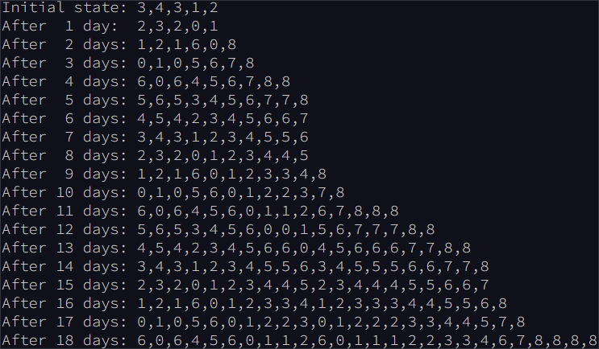

# [--- Day 6: Binary Diagnostic ---](https://adventofcode.com/2021/day/6)  

The sea floor is getting steeper. Maybe the sleigh keys got carried this way?

A massive school of glowing [lanternfish](https://en.wikipedia.org/wiki/Lanternfish) swims past. They must spawn quickly to reach such large numbers - maybe **exponentially** quickly? You should model their growth rate to be sure.

Although you know nothing about this specific species of lanternfish, you make some guesses about their attributes. Surely, each lanternfish creates a new lanternfish once every `7` days.

However, this process isn't necessarily synchronized between every lanternfish - one lanternfish might have 2 days left until it creates another lanternfish, while another might have 4. So, you can model each fish as a single number that represents **the number of days until it creates a new lanternfish**.

Furthermore, you reason, a **new** lanternfish would surely need slightly longer before it's capable of producing more lanternfish: two more days for its first cycle.

So, suppose you have a lanternfish with an internal timer value of `3`:

- After one day, its internal timer would become `2`.  
- After another day, its internal timer would become `1`.  
- After another day, its internal timer would become `0`.  
- After another day, its internal timer would reset to `6`, and it would create a **new** lanternfish with an internal timer of `8`.  
- After another day, the first lanternfish would have an internal timer of `5`, and the second lanternfish would have an internal timer of `7`.

A lanternfish that creates a new fish resets its timer to `6`, **not `7`** (because `0` is included as a valid timer value). The new lanternfish starts with an internal timer of `8` and does not start counting down until the next day.

Realizing what you're trying to do, the submarine automatically produces a list of the ages of several hundred nearby lanternfish (your puzzle input). For example, suppose you were given the following list:

`3,4,3,1,2`

This list means that the first fish has an internal timer of `3`, the second fish has an internal timer of `4`, and so on until the fifth fish, which has an internal timer of `2`. Simulating these fish over several days would proceed as follows:

Each day, a `0` becomes a `6` and adds a new `8` to the end of the list, while each other number decreases by 1 if it was present at the start of the day.

In this example, after 18 days, there are a total of `26` fish. After 80 days, there would be a total of **`5934`**.

Find a way to simulate lanternfish. **How many lanternfish would there be after 80 days?**

To begin, [get your puzzle input](./input.txt).

Answer: **386640**

---  

# Solution (Silver Star)  

Run the python scrip _main1.py_ to get the solution given the input file _input.txt_:  
`python3 main1.py`  

---  

# --- Part Two ---  

Suppose the lanternfish live forever and have unlimited food and space. Would they take over the entire ocean?

After 256 days in the example above, there would be a total of **`26984457539`** lanternfish!

**How many lanternfish would there be after 256 days?**

Answer: **2775870**

Although it hasn't changed, you can still [get your puzzle input](./input).

---  

# Solution (Gold Star)  

Run the python scrip _main2.py_ to get the solution given the input file _input.txt_:  
`python3 main2.py`  

